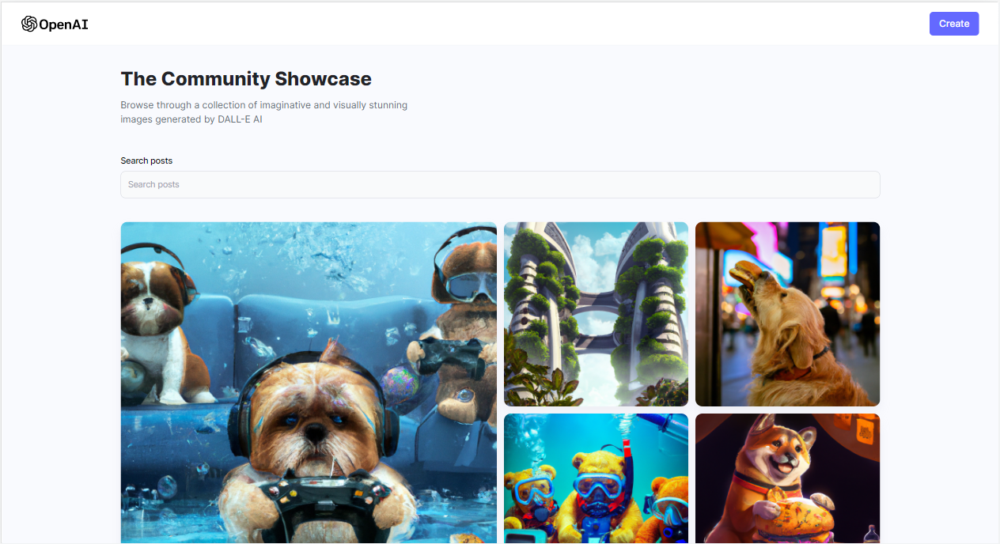
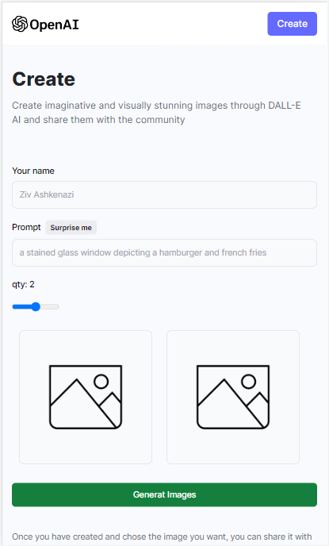

# MERN AI Art Generator 

A web application that allows users to generate AI images and share their creations with the community. 

## Technologies Used
- MongoDB
- Express
- ReactJS
- NodeJS

## Dive into my site
- [website link](https://ziv-ai-community.netlify.app/)

## Media

  
  

## Features
- User can generate up to 3 AI images at one time
- User can enter their name and share their creations with the community

## License
This project utilizes OpenAI's image generation API to allow users to generate AI images and share their creations with the community